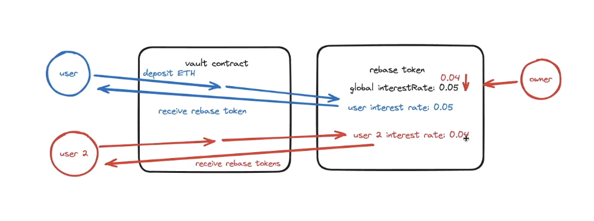

# Cross-chain Rebase Token

1. A protocol that allows user to deposit into a vault and, in return, receive rebase tokens that represent their underlying balance
2. Rebase token -> balanceOf function is dynamic to show the changing balance with time
   - Balance increases linearly with time
   - mint tokens to our users every time they perform an action (minting, burning, transferring, or... bridging)
3. Interest rate

   - Individually set an interest rate for each user based on some global interest rate of the protocol at the time the user deposits into the vault
   - This global interest rate can only decrease to incentivize/reward early adopters.
   - Increases token adoption

   

   Future edit:

   - Maybe add a check (regarding the issue of users first depositing a small amount to lock the high interest rate and then depositing large amount) to see if the amount they're depositing the second time is lower than the first time
